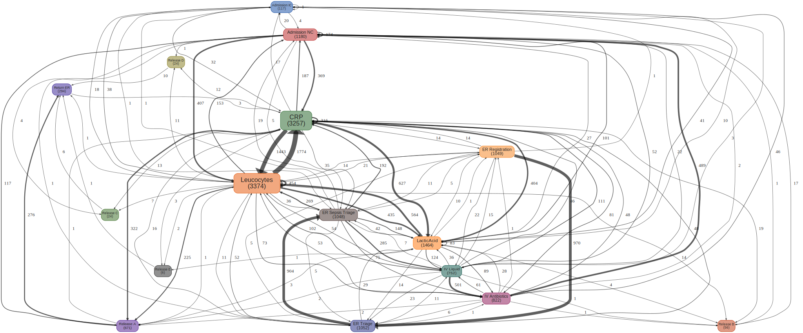
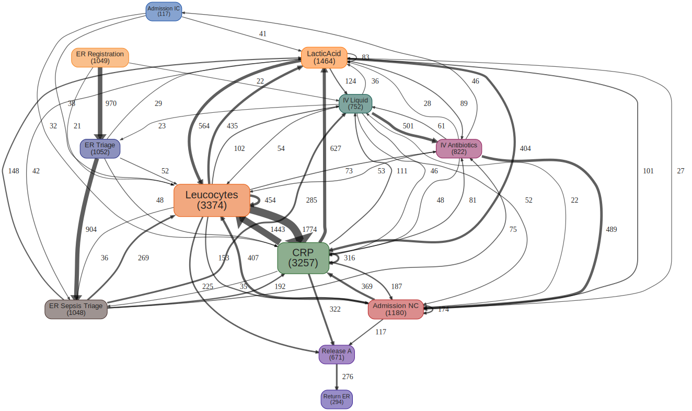

# Process Map

[![Build Status]][Travis] [![AppVeyor Build Status]][AppVeyor Link] [![Coverage status]][Coverage status link] [![Github Version]][Github Release Page] [![CRAN Version]][CRAN Link] [![Download Stats]][CRAN Link] [![License]][License Page]

[Build Status]: https://travis-ci.org/twang2218/pmap.svg?branch=master
[Travis]: https://travis-ci.org/twang2218/pmap

[CRAN Version]: http://www.r-pkg.org/badges/version/pmap
[CRAN Link]: https://cran.r-project.org/web/packages/pmap/index.html

[Github Version]: https://img.shields.io/github/release/twang2218/pmap.svg
[Github Release Page]: https://github.com/twang2218/pmap/releases

[Coverage status]: https://coveralls.io/repos/github/twang2218/pmap/badge.svg?branch=master
[Coverage status link]: https://coveralls.io/github/twang2218/pmap?branch=master

[Download Stats]: https://cranlogs.r-pkg.org/badges/grand-total/pmap?color=brightgreen

[AppVeyor Build Status]: https://ci.appveyor.com/api/projects/status/github/twang2218/pmap?branch=master&svg=true
[AppVeyor Link]: https://ci.appveyor.com/project/twang2218/pmap

[License]: https://img.shields.io/cran/l/pmap.svg
[License Page]: https://github.com/twang2218/pmap/blob/master/LICENSE.md

The goal of `pmap` is to provide the functionality of generating a process map from an event log with the user's preference.

## Installation

An older version of `pmap` is available on [CRAN](https://cran.r-project.org/web/packages/pmap/index.html), if you prefer to install this version, you can install it by:

```R
install.packages("pmap")
```

> However, based on the [CRAN policy](https://cran.r-project.org/web/packages/policies.html#Submission), a developer shouldn't submit a package to CRAN more than once within a month, therefore the [GitHub repo](https://github.com/twang2218/pmap/releases) will be the primary release channel, and the package will be submitted to CRAN only when it is possible. That is, the package version in CRAN can be a bit outdated.

To install the latest version, you can install `pmap` from GitHub directly:

```R
devtools::install_github("twang2218/pmap")
```

And, the users have the options to choose the installed version by specifying the version number in the command, as I [git tagged](https://github.com/twang2218/pmap/tags) each release:

```R
devtools::install_github("twang2218/pmap", ref = "v0.5.0")
```

## Usage

This is a demonstration of how to use `pmap` to create a process map from an event log. `sepsis` dataset in the `eventdataR` package will be used in the demonstration.

### Data preparation

Like any data analysis task, the first but the most important thing is to prepare our data.

Before the actual preparation steps, we should have a common ground on the terminology to be used later. There are mainly four terms, `Case`, `Activity`, `Category` and `Event`. The relation between the terms can be described as the following graph.

<p align="center"></p>

And `eventlog` is a collection of `Event`. So, each row in the `eventlog` represents an `Event` object, and each `Event` contains several attributes, including:

* when - `timestamp`;
* who - `case_id`;
* what - `activity` and `category`;

Therefore `pmap` requires three mandatory fields and one optional field in the given `eventlog` data frame:

* `timestamp`: Represent the timestamps of the events when they occurred. The data type should be `POSIXct`. For the case of data type of `timestamp` is `character`, the package will attempt to convert the column to `POSIXct`, but it's just handy in some cases, it's better to make sure the `timestamp` column is in correct data type.
* `case_id`: Represent `Case` ID in the process paths. It is used to calculate the activity frequency or process performance.
* `activity`: Activity name.
* `category`(_optional since v0.4.0_): It is used to differentiate the grouped activities by different colors for a better visualization purpose. For example, the marketing activities with different purposes can be visualized by different colors, with one purpose each. If `category` is missing, the `activity` name will be used as `category` for coloring by default.

> `category` was previously called `event_type`, and required before `v0.3.2`. It is no longer necessary after `v0.4.0`.

Now, let's do the data preparation.

``` r
library(eventdataR)
library(dplyr)
library(pmap)

# Prepare the event log data frame
> eventlog <- eventdataR::sepsis %>%
    rename(
      timestamp = Complete_Timestamp,
      case_id = Case_ID,
      activity = Activity
    ) %>%
    select(timestamp, case_id, activity) %>%
    na.omit()
```

Check `eventlog` data frame structure.

```R
> head(eventlog)
# A tibble: 6 x 3
  timestamp           case_id activity
  <dttm>              <chr>   <chr>
1 2014-10-22 11:15:41 A       ER Registration
2 2014-10-22 11:27:00 A       Leucocytes
3 2014-10-22 11:27:00 A       CRP
4 2014-10-22 11:27:00 A       LacticAcid
5 2014-10-22 11:33:37 A       ER Triage
6 2014-10-22 11:34:00 A       ER Sepsis Triage
> str(eventlog)
Classes ‘tbl_df’, ‘tbl’ and 'data.frame':       15190 obs. of  3 variables:
 $ timestamp: POSIXct, format: "2014-10-22 11:15:41" "2014-10-22 11:27:00" ...
 $ case_id  : chr  "A" "A" "A" "A" ...
 $ activity : chr  "ER Registration" "Leucocytes" "CRP" "LacticAcid" ...
 - attr(*, "na.action")=Class 'omit'  Named int [1:24] 442 443 444 445 446 447 448 449 450 451 ...
  .. ..- attr(*, "names")= chr [1:24] "442" "443" "444" "445" ...
```

### Create a process map

You can create a process map from the `eventlog` directly by running only one command:

```R
# Create process map
> p <- create_pmap(eventlog)
# Render the process map
> render_pmap(p)
```

The result will be shown in `Viewer` window if you're using R Studio, or in a new browser window if you're running the code from a Terminal.

<p align="center"></p>

### Prune the process map

As you can see, the above result is a bit messy, however, we can prune some edges with smaller volume to simplify the process map. It is a better way to find the common paths in the process.

```R
p %>% prune_edges(0.5) %>% render_pmap()
```

<p align="center"></p>

It's better, but we can improve it even better by pruning some not very important nodes as well.

```R
> p %>% prune_nodes(0.5) %>% prune_edges(0.5) %>% render_pmap()
```

Or, if you want a more interactive approach, you can start a Shiny server app with a slide bar for pruning the nodes and/or edges by a certain percentage. Just be careful, the more the edges and nodes, the slower the process will be. Let's keep `50%` nodes and `50%` edges in our example:

```R
> render_pmap_shiny(p, nodes_prune_percentage = 0.5, edges_prune_percentage = 0.5)
```

<p align="center"></p>

### Expand the loop

The above process map is great to find the valuable insights as we can immediately observe something very interesting insight from the map: the loop between `CRP` and `Leucocyte`. Is this because of a small group of cases repeatedly went through these two steps many many times? or is this because most cases went through the loop just a few times? To answer the question, we can expand the loop by distinct the repeated activity.

```R
> p <- create_pmap(eventlog, distinct_repeated_activities = TRUE)
```

By this way, each new activity name will be attached with the occurrence sequence number of the activity in the path, so the same activity occurs multiple times in the path will have a different name, which means different nodes in the final map. The newly generated the process map will be much more complex than before, so we need prune it further.

```R
> p %>% prune_nodes(0.5) %>% prune_edges(0.8) %>% render_pmap()
```

<p align="center"></p>

It's interesting to see that there isn't much connection between first time `CRP (1)` and `Leucocyte (1)`, however, the back and forth happened after `Admission NC`.

### Time is the key

Are this back and forth activity loop because of some kind of regular check after `Admission NC`? We are not sure from previous process map, because we don't know how long between each activity occurred. By default, the edge label will be the number of cases went between the two connected activities. We can change it for the duration of those connected activities to understand more about the process in a timely manner.

As there are multiple cases went through the path, we need to decide how to summarize the duration, such as:

* the maximum duration
* the minimum duration
* the mean duration
* the median duration

We can specify the kind of duration by given an `edge_label` argument to the `create_pmap()`.

```R
p <- create_pmap(eventlog, edge_label = "mean_duration")
p %>% prune_nodes(0.5) %>% prune_edges(0.8) %>% render_pmap()
```

or, it can be changed after the process map created by using `adjust_edge_label()` function.

```R
p <- adjust_edge_label(p, label = "mean_duration")
render_pmap(p)
```

<p align="center"></p>

By adding the duration between each path into the process map, we can eliminate the problem immediately, as it's not a loop. `Leucocyte` almost always occurred immediately after `CRP` occurred, but not the otherwise. It means `CRP` and `Leucocyte` occurred together in the same sequence, might belong to a blood test pack, and the patients will be tested regularly after `Admission NC`.

And we can also discover the patients would normally be released 2 days after `CRP` and `Leucocyte` test. It might because the test results came back ok, the patients will be released after 2 days observation without any further issue.

We can get that information from the process map clearly.

### Persistent the result

If you're happy with the result, you can save the process map to a PDF or other file format by replace `render_pmap()` with `render_pmap_file()`.

```R
p <- create_pmap(eventlog, edge_label = "mean_duration")
p %>% prune_nodes(0.5) %>% prune_edges(0.8) %>% render_pmap_file("sepsis_process_map.pdf")
```
