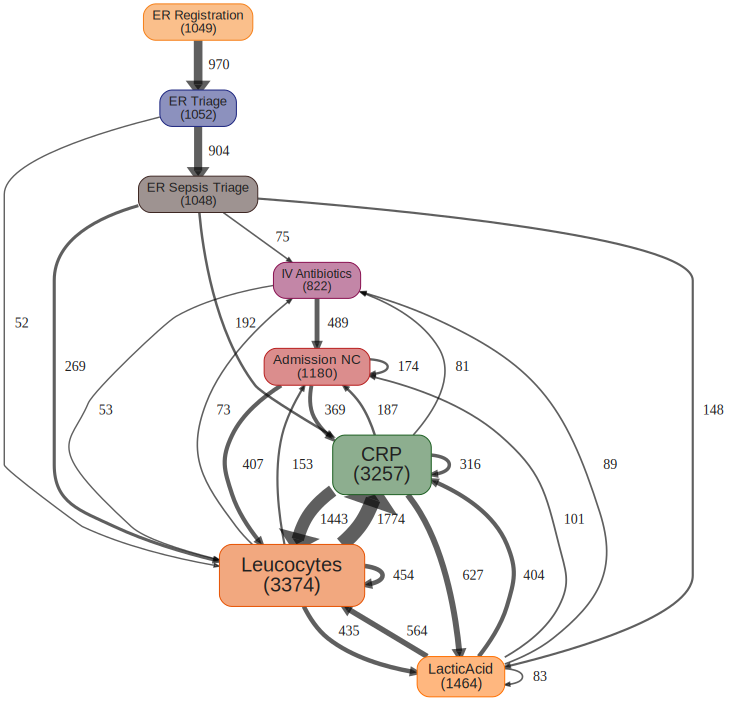

# Process Map

[![Build Status]][Travis] [![AppVeyor Build Status]][AppVeyor Link] [![Coverage status]][Coverage status link] [![CRAN Version]][CRAN Link] [![Download Stats]][CRAN Link]

[Build Status]: https://travis-ci.org/twang2218/pmap.svg?branch=master
[Travis]: https://travis-ci.org/twang2218/pmap

[CRAN Version]: http://www.r-pkg.org/badges/version/pmap
[CRAN Link]: https://cran.r-project.org/web/packages/pmap/index.html

[Coverage status]: https://coveralls.io/repos/github/twang2218/pmap/badge.svg?branch=master
[Coverage status link]: https://coveralls.io/github/twang2218/pmap?branch=master

[Download Stats]: https://cranlogs.r-pkg.org/badges/grand-total/pmap?color=brightgreen

[AppVeyor Build Status]: https://ci.appveyor.com/api/projects/status/github/twang2218/pmap?branch=master&svg=true
[AppVeyor Link]: https://ci.appveyor.com/project/twang2218/pmap

The goal of `pmap` is to provide functionality of generating a process map from an event log.

## Usage

This is a basic example which shows you how to use `pmap` create a process map from an event log. We use `sepsis` dataset in `eventdataR` package as the example.

``` r
library(eventdataR)
library(dplyr)
library(pmap)

# Prepare the event log data frame
> eventlog <- eventdataR::sepsis %>%
    rename(
      timestamp = Complete_Timestamp,
      customer_id = Case_ID,
      event_name = Activity
    ) %>%
    select(timestamp, customer_id, event_name) %>%
    filter(!is.na(customer_id))
```

Check eventlog data frame structure.

```R
> head(eventlog)
# A tibble: 6 x 3
  timestamp           customer_id event_name      
  <dttm>              <chr>       <chr>           
1 2014-10-22 11:15:41 A           ER Registration 
2 2014-10-22 11:27:00 A           Leucocytes      
3 2014-10-22 11:27:00 A           CRP             
4 2014-10-22 11:27:00 A           LacticAcid      
5 2014-10-22 11:33:37 A           ER Triage       
6 2014-10-22 11:34:00 A           ER Sepsis Triage

> str(eventlog)
Classes ‘tbl_df’, ‘tbl’ and 'data.frame':	15190 obs. of  3 variables:
 $ timestamp  : POSIXct, format: "2014-10-22 11:15:41" ...
 $ customer_id: chr  "A" "A" "A" "A" ...
 $ event_name : chr  "ER Registration" "Leucocytes" "CRP" "LacticAcid" ...
 - attr(*, "case_id")= chr "Case_ID"
 - attr(*, "activity_id")= chr "Activity"
 - attr(*, "activity_instance_id")= chr "activity_instance"
 - attr(*, "lifecycle_id")= chr "lifecycle_transition"
 - attr(*, "timestamp")= chr "Complete_Timestamp"
 - attr(*, "resource_id")= chr "org_group"
```

Create process map from the `eventlog`.

```R
# Create process map
> p <- create_pmap(eventlog)
# Render the process map
> print(render_pmap(p))
```

The result will be a bit messy.

<p align="center"></p>

Let's prune the process map.

```R
# Prune the process map
> p <- p %>% prune_edges(0.5) %>% prune_nodes(0.5)
# Render the pruned process map
> print(render_pmap(p))
```


<p align="center"></p>